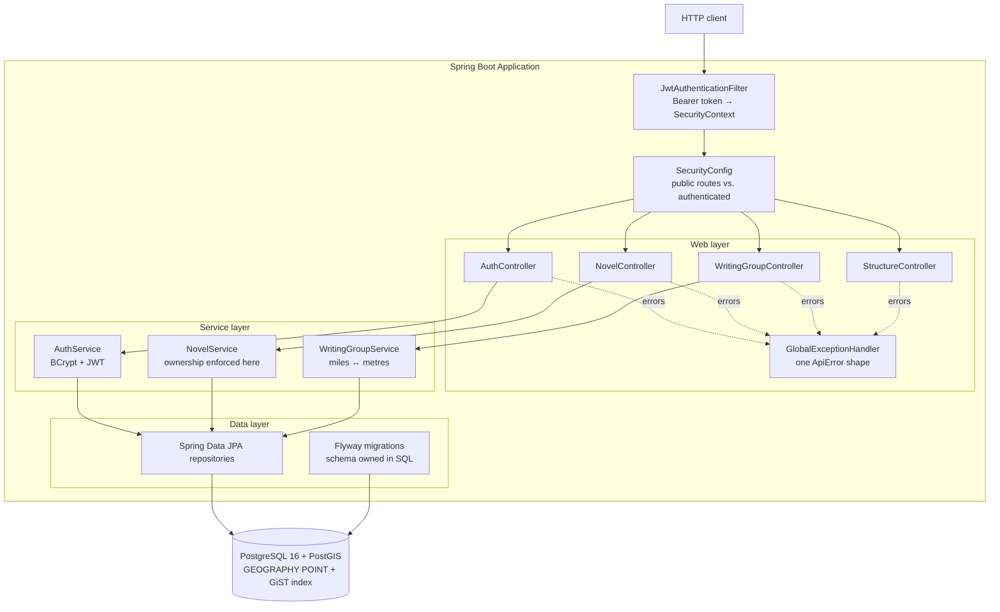

# Wordsmith

A REST API for novelists. Pick a story structure — Three-Act, Save the Cat — and its
beats become an editable outline for your novel. Then find writing groups near you.

Built with Spring Boot 4, Java 21, and PostgreSQL + PostGIS.

[](https://github.com/nidhivgandhi/Wordsmith/actions/workflows/ci.yml)

**Live:** <https://wordsmith-ps3q.onrender.com>

```bash
# Writing groups within 25 miles of Brooklyn — no account needed
curl "https://wordsmith-ps3q.onrender.com/api/groups/search?lat=40.6782&lon=-73.9442&radiusMiles=25"
```

> Hosted on a free tier that sleeps after 15 minutes idle, so the **first request may
> take ~50 seconds** while the container wakes. Everything after that is fast.

---

## What it does

**Outlining.** A *story structure* is a template: an ordered list of beats ("Opening
Image", "Catalyst", "Dark Night of the Soul"). Creating a novel instantiates that
template — every template beat becomes an editable beat belonging to your novel, which
you fill in as you draft. Structures are seeded as data via migrations, so adding a new
one is a migration, not a code change.

**Community.** Writing groups have a real location on Earth. `GET /api/groups/search`
answers "which groups are within X miles of me?", nearest first, using PostGIS.

**Ownership.** Novels belong to a user. Only their owner can read or modify them.

---

## Architecture



**Layering rule:** controllers do HTTP, services do rules, repositories do data.
Authorization lives in the *service* layer, never the controller — a controller check
protects one endpoint, a service check protects every caller of that service.

**The database owns the schema.** Flyway migrations are the single source of truth and
Hibernate runs with `ddl-auto: validate`, so it verifies the mapping and refuses to
start if entities and schema have drifted. It never modifies anything.

---

## Quick start

Requires Java 21 and Docker.

```bash
# 1. Start PostGIS
docker compose -f src/main/java/io/github/nidhivgandhi/wordsmith/docker-compose.yml up -d

# 2. Run the app (Flyway migrates and seeds on first boot)
./mvnw spring-boot:run
```

The API is on `http://localhost:8080`.

```bash
# Find writing groups within 25 miles of Brooklyn — no account needed
curl "http://localhost:8080/api/groups/search?lat=40.6782&lon=-73.9442&radiusMiles=25"

# Register, and keep the token
TOKEN=$(curl -s -X POST http://localhost:8080/api/auth/register \
  -H 'Content-Type: application/json' \
  -d '{"email":"you@example.com","password":"correct horse battery","displayName":"You"}' \
  | grep -o '"token":"[^"]*"' | cut -d'"' -f4)

# Start a novel on structure 1
curl -X POST http://localhost:8080/api/novels \
  -H "Authorization: Bearer $TOKEN" -H 'Content-Type: application/json' \
  -d '{"structureId":1,"title":"My Novel","premise":"A cartographer loses their map."}'
```

---

## API

| Method | Endpoint | Auth | Description |
|---|---|---|---|
| `POST` | `/api/auth/register` | — | Create an account, returns a JWT |
| `POST` | `/api/auth/login` | — | Exchange credentials for a JWT |
| `GET` | `/api/auth/me` | ✔ | Who the current token belongs to |
| `GET` | `/api/structures` | — | List story structures |
| `GET` | `/api/structures/{id}` | — | One structure and its beats |
| `GET` | `/api/groups/search` | — | Groups within `radiusMiles` of `lat`/`lon`, nearest first |
| `GET` | `/api/groups` | — | All writing groups |
| `GET` | `/api/groups/{id}` | — | One writing group |
| `POST` | `/api/groups` | ✔ | Create a writing group |
| `GET` | `/api/novels` | ✔ | Your novels |
| `POST` | `/api/novels` | ✔ | Create a novel from a structure |
| `GET` | `/api/novels/{id}` | ✔ | One of your novels, with beats |
| `PATCH` | `/api/novels/{id}/beats/{beatId}` | ✔ | Update a beat's notes or status |

Discovery is public on purpose — you should be able to find a writing group before
committing to an account. Everything else is authenticated by a catch-all rule, so a
route added later is private by default rather than accidentally open.

Every error, including 401 and 403 raised inside the filter chain, uses one shape:

```json
{
  "timestamp": "2026-08-08T23:41:50.562Z",
  "status": 400,
  "error": "Bad Request",
  "message": "Validation failed",
  "fieldErrors": { "radiusMiles": "radiusMiles must be at most 500" }
}
```

---

## Geospatial search

The headline feature, and the part most worth reading.

### The column

```sql
location GEOGRAPHY(POINT, 4326) NOT NULL
```

`GEOGRAPHY`, not `GEOMETRY`. `GEOMETRY` does flat-plane maths, so the distance between
two lat/lon points comes out in **degrees** — which is not a distance: a degree of
longitude is about 69 miles at the equator and approximately zero at the poles.
`GEOGRAPHY` does spherical maths and answers in **metres**, correctly, anywhere on
Earth. It costs more per row, and for "which groups are near me" that is the right
trade. SRID 4326 is WGS84, the system GPS and mapping APIs speak.

### The query

```sql
SELECT g.id, g.name,
       ST_Distance(g.location, CAST(ST_SetSRID(ST_MakePoint(:longitude, :latitude), 4326) AS geography))
           AS "distanceMeters"
FROM writing_groups g
WHERE ST_DWithin(
          g.location,
          CAST(ST_SetSRID(ST_MakePoint(:longitude, :latitude), 4326) AS geography),
          :radiusMeters)
ORDER BY "distanceMeters"
```

**`ST_DWithin` filters; `ST_Distance` only reports.** Both would give the same answer,
but `ST_DWithin` can use the GiST index on `location` to discard most rows on bounding
boxes alone, while `WHERE ST_Distance(...) < x` must compute an exact spherical distance
for every row in the table before it can compare. `ST_Distance` still appears in the
`SELECT`, where it runs only for rows that already survived the filter — and the number
is needed anyway, to sort and to show "7.4 miles away".

```sql
CREATE INDEX idx_writing_groups_location ON writing_groups USING GIST (location);
```

### The two conversions that fail silently

Both are confined to one class, [`GeoUtils`](src/main/java/io/github/nidhivgandhi/wordsmith/group/GeoUtils.java):

1. **Coordinate order.** PostGIS and JTS store a point as `(x, y)` — which for lat/lon
   means `(longitude, latitude)`, the reverse of how people say it. Swapping them
   produces a *valid point in the wrong hemisphere* rather than an error. The API takes
   named `lat`/`lon` fields so callers cannot get it wrong, and the swap happens in
   exactly one line.
2. **Units.** PostGIS answers in metres; the API speaks miles. Converting at a single
   boundary keeps everything below the service layer metric.

The radius is capped at 500 miles. An uncapped radius is a full table scan wearing a
search endpoint's clothes.

---

## Authentication and ownership

Register or log in, get a signed JWT, send it as `Authorization: Bearer <token>`.
A `OncePerRequestFilter` validates the token and populates the `SecurityContext`.

Three decisions worth calling out:

**Passwords use BCrypt**, which is deliberately slow and stores its own random salt
inside each hash. Two identical passwords hash differently, and one leaked table cannot
be attacked with a precomputed rainbow table. A fast hash like SHA-256 is the wrong tool
here precisely *because* it is fast — speed helps the attacker.

**Login answers identically** for an unknown email and a wrong password. Distinguishing
them turns the login form into a tool for discovering which email addresses have
accounts.

**Someone else's novel returns 404, not 403.** A 403 confirms the row exists, and
walking the id range then maps out the database. The implementation matters as much as
the status code: the repository method is `findByIdAndOwnerId`, so a row that is not
yours never loads. "Fetch it, then check whether you're allowed" is one forgotten `if`
away from a leak.

The filter itself never rejects anything — a bad token simply leaves the request
unauthenticated, and `SecurityConfig` decides whether that is acceptable for the path.
Keeping *who are you* separate from *are you allowed* is what lets group search stay
public without the filter knowing about it.

---

## Testing

```bash
./mvnw test      # unit + web-slice tests. No Docker, no database. Seconds.
./mvnw verify    # the above, plus integration tests against a real PostGIS container.
```

The split is by cost. Keeping them together would mean either paying container startup
on every small change or never running the slow ones.

| Kind | Naming | What it covers |
|---|---|---|
| Unit | `*Test` | JWT signing and rejection, BCrypt, coordinate/unit conversion, ownership rules |
| Web slice | `*Test` | `@WebMvcTest` — routing, validation, response shape, security rules |
| Integration | `*IT` | Testcontainers — migrations, `ddl-auto: validate`, the real `ST_DWithin` query |

The geospatial query is native PostGIS SQL, so an in-memory database could never run it.
`WritingGroupRepositoryIT` asserts nearest-first ordering, radius boundaries, spherical
distance in metres, and coordinates read back in the right order — against actual PostGIS.

> Testcontainers must stay at **1.21.4+**. Earlier versions cannot negotiate with Docker
> Engine 29+ and fail with a misleading "Could not find a valid Docker environment".

---

## Deployment

Containerised with a multi-stage build: a Maven image compiles, and a JRE image runs the
jar as a non-root user. The final image carries the runtime and the jar, not the toolchain
that produced it.

```bash
docker build -t wordsmith .
docker run -p 8080:8080 \
  -e SPRING_PROFILES_ACTIVE=prod \
  -e DB_HOST=... -e DB_USER=... -e DB_PASSWORD=... \
  -e JWT_SECRET="$(openssl rand -base64 48)" \
  wordsmith
```

[`render.yaml`](render.yaml) describes the web service and its managed Postgres as code:
database credentials are wired in as environment variables and `JWT_SECRET` is generated
by the platform, so no secret is ever committed.

The `prod` profile declares `JWT_SECRET` with **no fallback**. A deploy that forgets it
fails immediately rather than quietly running on the development secret that lives in
this repo — where anyone reading the source could mint valid tokens.

**To deploy:** connect this repository as a Blueprint at
[dashboard.render.com](https://dashboard.render.com/select-repo?type=blueprint), and
Render reads `render.yaml`. The first boot runs every migration, including
`CREATE EXTENSION postgis` — so PostGIS is enabled by the same migration history that
runs locally, with no manual database setup. Pushes to `main` deploy automatically.

---

## Roadmap

Pillars 1 and 2 are complete; see [ROADMAP.md](ROADMAP.md) for what's next — a frontend,
then writing goals, word-count logging and streaks.
